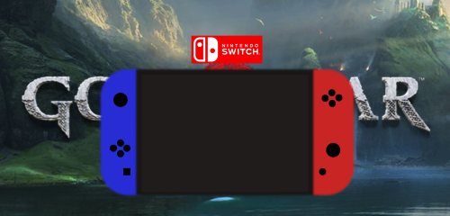

# Videoconsola con HTML y CSS 

Os presento mi primer proyecto en GeeksHubs basado en la consola Nintendo Switch, para ello he utilizado el lenguaje de programación HTML y CSS
como podéis observar en la imagen he aplicado un poco de sobra alrededor para crear un efecto 3D,
además, he incorporado un segundo efecto que consiste en que cuando deslizas el cursor sobre la pantalla de la consola se activa un video, en esta ocasión he elegido el juego God of War.

##### Autor 

José Ramón Rosario Santana

##### Licencia

Este proyecto está creado bajo una licencia *MIT License*.

